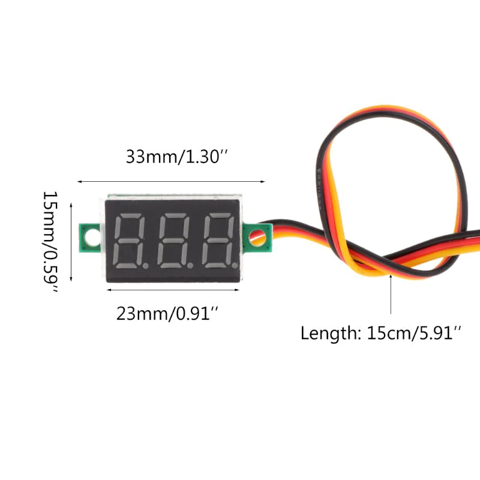
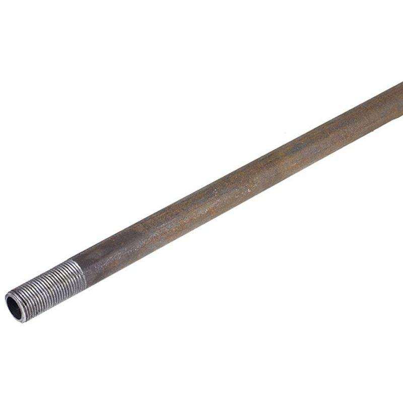
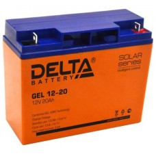

# Электро-автомобиль

## Цели проекта:

* [ ] Занять Андрея интересной задачей
* [x] Себя повеселить
* [ ] Собрать электро-автомобиль на 4-х колёсах
* [ ] Покататься минимум 1 час на нём \(получить удовлетворение\)
* [ ] Оценить возможности собрать это "**на коленке**"
* [ ] Прицениться, что можно использовать для реализации данного проекта
* [ ] После реализации первой ревизии понять, что с этим можно делать дальше 
* [ ] Попробовать реализовать простые в исполнении стиринг системы на базе данного авто
* [ ] После оценки первой ревизии оценить возможность создания автономного робота для уборки территории \(снега/мусора\).
* [ ] Поработать в связки со Святом

## Ревизия 0.1:

Ревизия один, это жёсткая рама из уголков или труб, единая задняя ось на оба колеса\(дифференциал отсутствует\), передний полу оси крепятся к раме без подвески, поворотные рычаги соединены с рычагом рулевого вала через рычаги на шаровых опорах для устранения сильного люфта. Конструкция без подвески максимально простая. Конструкция рамы должна предусматривать комфортное размещение одного водителя и всех элементов силовой части \(мотор аккумуляторы\).

## Список текущих покупок:

| Название/ссылка | Назначение | Картинка  | штук | ценник | в наличии |
| :--- | :--- | :--- | :--- | :--- | :--- |
| [BLDC мотор 60V 2000W + Мотор контроллер](https://ru.aliexpress.com/item/48V-60V-2000W-DC-Motor-Electric-Bicycle-Conversion-Kit-Electric-Scooter-Brushless-Motor-Controller-With-Reverse/32949728800.html?spm=a2g0v.10010108.1000016%2FB.1.473d4910w32r43&isOrigTitle=true) | Тяговый мотор задней ведущей оси, и контроллер мотора для регулирования скорости вращения |  | 1 | 14 478,51 | 0 |
| [Вольтметр](https://ru.aliexpress.com/item/Mini-0-36-inch-DC-0-100v-3-bits-Digital-Red-LED-Display-Panel-Voltage-Meter/32952874699.html?spm=a2g0v.10010108.1000016%2FB.1.4c19143a6i1O56&isOrigTitle=true) | Для показа текущего заряда батарей |  | 2 | 111,68 | 0 |
| [Цепь T8F, шаг 8 мм, 129 звеньев](https://www.aliexpress.com/snapshot/0.html?orderId=703680554219661) | Будет передавать момент от звездочки мотора на звёздочку вала колёс |  | 1 | 702,46 | 0 |
| [Приводная звездочка T8F 64 зуба](https://www.aliexpress.com/snapshot/0.html?orderId=703650765399661) | Передаёт момент на вал колёс |  | 1 | 778,98 | 1 |
| [Тормозной комплект: диск, суппорт, шланг, цилиндр, бачок](https://ru.aliexpress.com/item/200CC-250CC-ATV-Quad-Foot-brake-Hydraulic-Caliper-Brake-Disk-Disc-Assy-200cc-250cc-ATV-Quad/32813148385.html?spm=a2g0s.9042311.0.0.274233edrPo7SP) | Тормозной диск устанавливается на вал задних колёс, суппорт крепиться в плоскости диска на раме, к цилиндру подводится привод педали |  | 1 | 2 355,90 | 0 |

## Что нужно приобрести:

<table>
  <thead>
    <tr>
      <th style="text-align:left">Название</th>
      <th style="text-align:left">Описание</th>
      <th style="text-align:left">Картинка</th>
      <th style="text-align:left">Штук</th>
      <th style="text-align:left">ценник</th>
    </tr>
  </thead>
  <tbody>
    <tr>
      <td style="text-align:left"><a href="https://mirprivoda.ru/zvezdochki-cepnye/zvezdochki-bez-stupicy-pod-rastochku/odnoryadnye-1/">Звёздочки однорядные</a>
      </td>
      <td style="text-align:left">возможно для использования второй ступени редуктора</td>
      <td style="text-align:left">
        
      </td>
      <td style="text-align:left">2</td>
      <td style="text-align:left"></td>
    </tr>
    <tr>
      <td style="text-align:left"><a href="https://leroymerlin.ru/product/truba-profilnaya-40h20h3000-mm-13376752/">Профиль 20*40*3000 мм (толщина 1.5 мм)</a>
      </td>
      <td style="text-align:left">для изготовления рамы</td>
      <td style="text-align:left">
        
      </td>
      <td style="text-align:left">?</td>
      <td style="text-align:left">251,00</td>
    </tr>
    <tr>
      <td style="text-align:left"><a href="https://leroymerlin.ru/product/polosa-metallicheskaya-4h40x3000-mm-15790957/">Полоса металлическая 4*40*3000 мм</a>
      </td>
      <td style="text-align:left">для площадок под крепление опор</td>
      <td style="text-align:left">
        
      </td>
      <td style="text-align:left">1</td>
      <td style="text-align:left">386,00</td>
    </tr>
    <tr>
      <td style="text-align:left"><a href="https://leroymerlin.ru/product/truba-stalnaya-chernaya-3-4-l1-15466831/">Труба стальная черная 3/4 Длинна 1 М. внутренний диаметр 20 мм</a>
      </td>
      <td style="text-align:left">Может быть использована как вал руля</td>
      <td style="text-align:left">
        
      </td>
      <td style="text-align:left">?</td>
      <td style="text-align:left">550</td>
    </tr>
    <tr>
      <td style="text-align:left"><a href="https://leroymerlin.ru/product/truba-kruglaya-25h1h2000-mm-13536314/">Труба круглая 25х1х2000</a>
      </td>
      <td style="text-align:left">Возможно использовать в качестве втулок на валу, для посадки ступиц, тормозного
        диска и звёздочки</td>
      <td style="text-align:left">
        
      </td>
      <td style="text-align:left">?</td>
      <td style="text-align:left">418,00</td>
    </tr>
    <tr>
      <td style="text-align:left"><a href="https://leroymerlin.ru/product/koleso-dlya-tachki-pnevmaticheskoe-689833-18513453/">Колесо для тачки</a>
      </td>
      <td style="text-align:left">Колёса на переднюю подвеску. <a href="http://sadovod06.ru/koleso-dlya-stroitelnoy-tachki--odn">Тут описание размеров</a>
      </td>
      <td style="text-align:left">
        
      </td>
      <td style="text-align:left">2</td>
      <td style="text-align:left">752,00</td>
    </tr>
    <tr>
      <td style="text-align:left"><a href="http://podolsk-privod.ru/sites/default/files/uzly_korpusnyh_podshipnikov.pdf">Подшипниковый узел UCP 205</a>
      </td>
      <td style="text-align:left">2 шт. на заднюю ось, 2 шт на руль</td>
      <td style="text-align:left">
        
      </td>
      <td style="text-align:left">4?</td>
      <td style="text-align:left"></td>
    </tr>
    <tr>
      <td style="text-align:left"><a href="http://podolsk-privod.ru/catalog/shponochnaya-panel/valy">Вал калиброванный 25 мм</a>
      </td>
      <td style="text-align:left">все валы в конструкции</td>
      <td style="text-align:left">
        
      </td>
      <td style="text-align:left">?</td>
      <td style="text-align:left"></td>
    </tr>
    <tr>
      <td style="text-align:left"><a href="https://econrj.ru/akkumuljatornie-batarei/akkumuljatornie-batarei-delta/akkumuljatornaja-batareja-delta-gel-12-20.html">Аккумуляторная батарея 12 В 20 Ач</a>
      </td>
      <td style="text-align:left">Основной источник питания</td>
      <td style="text-align:left">
        
      </td>
      <td style="text-align:left">4</td>
      <td style="text-align:left"></td>
    </tr>
    <tr>
      <td style="text-align:left"><a href="https://dvizhcom.ru/catalogs/82832/?utm_source=yandex-market&amp;utm_medium=cpc&amp;utm_campaign=yandex-market&amp;utm_term=82832&amp;_openstat=bWFya2V0LnlhbmRleC5ydTvQqNCw0YDQvdC40YAg0LrQsNGA0LTQsNC90L3Ri9C5INGA0YPQu9C10LLQvtCz0L4g0LLQsNC70LAg0KPQkNCXINCz0YDRg9C30L7QstC-0Lkg0YEg0JPQo9CgICjQkNCU0KEpO1dDajN3WXp6NV9aU09DUVE5TnBKb2c7&amp;ymclid=15487638018637396047800028">Шарнир карданный рулевого</a>
      </td>
      <td style="text-align:left">Возможно использовать в рулевой колонке</td>
      <td style="text-align:left">
        
      </td>
      <td style="text-align:left">?</td>
      <td style="text-align:left"></td>
    </tr>
    <tr>
      <td style="text-align:left"><a href="https://dvizhcom.ru/catalogs/82831/">Шарнир карданный руливой</a>
      </td>
      <td style="text-align:left"></td>
      <td style="text-align:left">
        
      </td>
      <td style="text-align:left">?</td>
      <td style="text-align:left"></td>
    </tr>
    <tr>
      <td style="text-align:left"><a href="https://podtrade.ru/product/42568/">Шарнирная головка SA 08</a>
      </td>
      <td style="text-align:left">Для управления поворотом колёс</td>
      <td style="text-align:left">
        
      </td>
      <td style="text-align:left">4?</td>
      <td style="text-align:left"></td>
    </tr>
    <tr>
      <td style="text-align:left"><a href="https://www.ulmart.ru/goods/4297378">Руль</a>
      </td>
      <td style="text-align:left">На самом деле может быть любой, но лучше всего с отверстиями под болты,
        а не под шлицы</td>
      <td style="text-align:left">
        
      </td>
      <td style="text-align:left">1</td>
      <td style="text-align:left"></td>
    </tr>
    <tr>
      <td style="text-align:left"><a href="https://www.tzc.ru/contact/">Приводные цепи</a>
      </td>
      <td style="text-align:left"></td>
      <td style="text-align:left"></td>
      <td style="text-align:left">?</td>
      <td style="text-align:left"></td>
    </tr>
    <tr>
      <td style="text-align:left"><a href="https://prodacha.ru/products/stupitsa_kolesa_4_0x8_4_otverstiya_kvadratnaya">Ступица заднего колеса</a>
      </td>
      <td style="text-align:left">Устанавливается на заднюю ось</td>
      <td style="text-align:left">
        
      </td>
      <td style="text-align:left">2</td>
      <td style="text-align:left"></td>
    </tr>
    <tr>
      <td style="text-align:left"><a href="https://moskva.tiu.ru/p77217156-koleso-sbore-dlya.html">Колесо заднее</a>
      </td>
      <td style="text-align:left">Крепиться к ступицы задней оси</td>
      <td style="text-align:left">
        
      </td>
      <td style="text-align:left">2</td>
      <td style="text-align:left">5420 р.</td>
    </tr>
    <tr>
      <td style="text-align:left"><a href="https://samara.leroymerlin.ru/product/list-riflenyy-amg2-1-5h600h1200-mm-13322009/">Лист рифлёный АМг2</a>
      </td>
      <td style="text-align:left">Пол в машине</td>
      <td style="text-align:left">
        
      </td>
      <td style="text-align:left">?</td>
      <td style="text-align:left"></td>
    </tr>
    <tr>
      <td style="text-align:left"><a href="https://moscow.petrovich.ru/catalog/94778115/612298/">Лист 4 мм толщиной</a>
      </td>
      <td style="text-align:left">Возможно использовать как площадку для крепления мотора и изготовления
        деталей поворотного узла</td>
      <td style="text-align:left">
        
      </td>
      <td style="text-align:left">1</td>
      <td style="text-align:left"></td>
    </tr>
    <tr>
      <td style="text-align:left"><a href="https://www.tzc.ru/contact/">Цепи</a>
      </td>
      <td style="text-align:left">Для цепного редуктора</td>
      <td style="text-align:left">
        
      </td>
      <td style="text-align:left">?</td>
      <td style="text-align:left"></td>
    </tr>
    <tr>
      <td style="text-align:left"><a href="https://technobearing.ru/eshop1/folder/shkivy-1">Шкивы</a>
      </td>
      <td style="text-align:left">может понадобиться</td>
      <td style="text-align:left">
        
      </td>
      <td style="text-align:left">?</td>
      <td style="text-align:left"></td>
    </tr>
    <tr>
      <td style="text-align:left">
        

        
 <a href="https://scooter-zip.ru/category/product/dvigateli-obshego-naznacheniya/168f-2r-20/?utm_source=google&amp;utm_medium=cpc&amp;utm_utm_campaign=scooter-zip.ru_merchant_xml&amp;utm_content=k50id|pla-293946777986|cid|1684223028|aid|326919998551|gid|69212921967|pos|1o2|src|g_|dvc|c|reg|9047030|rin||&amp;utm_campaign=merchant_xml|1684223028&amp;utm_term=&amp;k50id=69212921967|pla-293946777986&amp;gclid=Cj0KCQiA4aXiBRCRARIsAMBZGz-kGIPaPlVXfFyfHMDuAiHpsaVTsw9cJX9-X5sQZmcOWJatf1O8K_QaAlywEALw_wcB">бензиновый двигатель</a>
        

      </td>
      <td style="text-align:left">Можно рассматривать в замен электрическому</td>
      <td style="text-align:left">
        
      </td>
      <td style="text-align:left">?</td>
      <td style="text-align:left"></td>
    </tr>
    <tr>
      <td style="text-align:left"><a href="https://www.pro-kart.ru/catalog/zapchasti_dlya_kartinga/plastik/418/">Сидение для карта взрослое</a>
      </td>
      <td style="text-align:left">сидение</td>
      <td style="text-align:left">
        
      </td>
      <td style="text-align:left">1</td>
      <td style="text-align:left"></td>
    </tr>
    <tr>
      <td style="text-align:left"><a href="https://stoolgroup.ru/stul-eames-daw-zheltyy.html">Стул</a>
      </td>
      <td style="text-align:left">Можно использовать в качестве сидения</td>
      <td style="text-align:left">
        
      </td>
      <td style="text-align:left">?</td>
      <td style="text-align:left"></td>
    </tr>
    <tr>
      <td style="text-align:left">планетарная втулку Shimano Nexus 8</td>
      <td style="text-align:left">Можно использовать в качестве коробки передач</td>
      <td style="text-align:left">
        
      </td>
      <td style="text-align:left"></td>
      <td style="text-align:left"></td>
    </tr>
  </tbody>
</table>## Чертежи:

[Тут](https://cad.onshape.com/documents/b21316542eaf4da69c60d175/w/06073950ddc738940ec0cbc6/e/556605455fa058c1a579c8e5), начал рисовать переднюю ось:

## Интересные примеры работ:

* [https://www.youtube.com/watch?v=XMEa6pdnk40](https://www.youtube.com/watch?v=XMEa6pdnk40)
* [https://www.youtube.com/watch?v=NnhKpjoD31w](https://www.youtube.com/watch?v=NnhKpjoD31w)
* [https://www.youtube.com/watch?v=yn7LlvugyiA&list=PLoL6eIYWPO\_mE6WijMU-V1SSmDdEUpnlI&index=4](https://www.youtube.com/watch?v=yn7LlvugyiA&list=PLoL6eIYWPO_mE6WijMU-V1SSmDdEUpnlI&index=4)
* [https://www.youtube.com/watch?v=wcFaIFFbP0g](https://www.youtube.com/watch?v=wcFaIFFbP0g)

[тест](https://www.lucidchart.com/documents/view/87a869f9-1934-4aa8-aa71-38d68081c820/0)

##  Заметки по конструкции: 

1. [ ] Заменить все вращающиеся подшипники скольжения водопроводная\_трубка-вал\_калиброванный на опоры
2. [ ] упростить поворотный узел, устранить слабые места

## Заметки:

* на добавленной в закупочный лист тормозной системе короткий шланг. Можно купить удлиненный? 
  * сначала нужно проверить длину того, что приедет когда нибудь, возможность купить шланг или трубку всегда есть, запчасти от российского авто-прома подойдут
* А тормозная система от велосипеда не подходит из за большого веса багги?
  * то что должно придти не от велика, а от квадрацикла, должно подходить.
* не смог найти подходящего кресла, может плохо искал. Как вариант думаю можно самим сделать каркас и прикрутить к нему обивку - сиденье и спинку.
  * нужно смотреть кресла от картинга  или просто пластиковую мебель.
* Для педали электродвигателя требуется реостат?

  * нет не требуется, в комплекте с мотором всё есть

  тест-2

