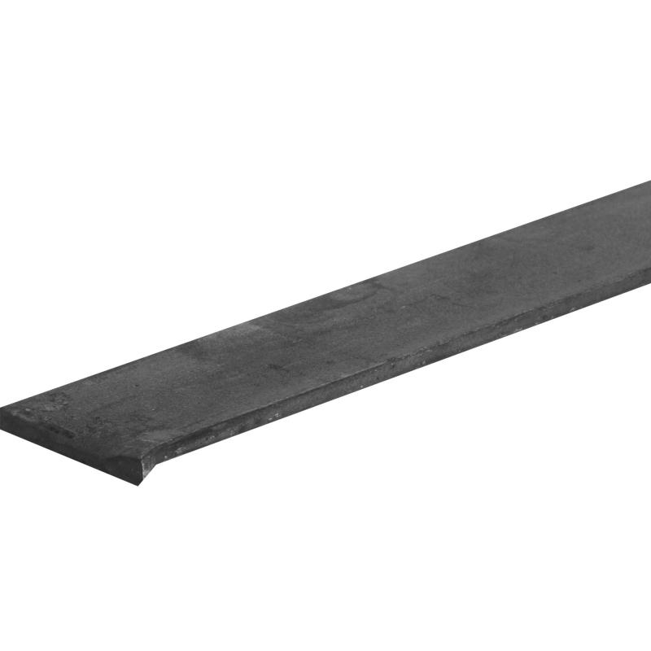
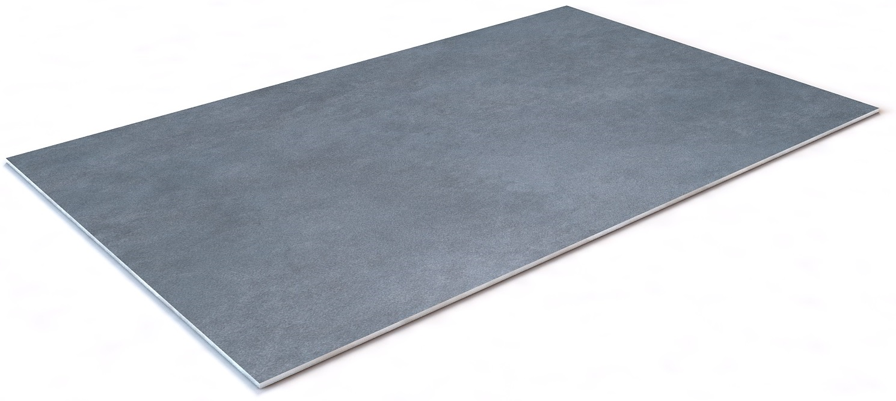
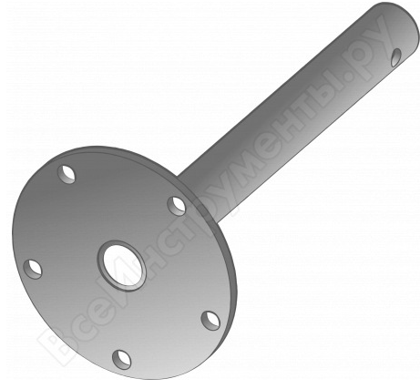

# Электро-автомобиль

## Цели проекта:

* [x] Занять Андрея интересной задачей
* [x] Себя повеселить
* [ ] Собрать электро-автомобиль на 4-х колёсах
* [ ] Покататься минимум 1 час на нём \(получить удовлетворение\)
* [x] Оценить возможности собрать это "**на коленке**"
* [ ] Прицениться, что можно использовать для реализации данного проекта
* [ ] После реализации первой ревизии понять, что с этим можно делать дальше 
* [ ] Попробовать реализовать простые в исполнении стиринг системы на базе данного авто
* [ ] После оценки первой ревизии оценить возможность создания автономного робота для уборки территории \(снега/мусора\).

## Ревизия 0.1:

Ревизия один, это жёсткая рама из уголков или труб, единая задняя ось на оба колеса\(дифференциал отсутствует\), передний полу оси крепятся к раме без подвески, поворотные рычаги соединены с рычагом рулевого вала через рычаги на шаровых опорах для устранения сильного люфта. Конструкция без подвески максимально простая. Конструкция рамы должна предусматривать комфортное размещение одного водителя и всех элементов силовой части \(мотор аккумуляторы\).

## Закупленные компоненты:

| Название/ссылка | Назначение | Картинка  | штук | ценник | в наличии |
| :--- | :--- | :--- | :--- | :--- | :--- |
| [BLDC мотор 60V 2000W + Мотор контроллер](https://ru.aliexpress.com/item/48V-60V-2000W-DC-Motor-Electric-Bicycle-Conversion-Kit-Electric-Scooter-Brushless-Motor-Controller-With-Reverse/32949728800.html?spm=a2g0v.10010108.1000016%2FB.1.473d4910w32r43&isOrigTitle=true) | Тяговый мотор задней ведущей оси, и контроллер мотора для регулирования скорости вращения |  | 1 | 14 478,51 | 1 |
| [Вольтметр](https://ru.aliexpress.com/item/Mini-0-36-inch-DC-0-100v-3-bits-Digital-Red-LED-Display-Panel-Voltage-Meter/32952874699.html?spm=a2g0v.10010108.1000016%2FB.1.4c19143a6i1O56&isOrigTitle=true) | Для показа текущего заряда батарей |  | 2 | 111,68 | 0 |
| [Цепь T8F, шаг 8 мм, 129 звеньев](https://www.aliexpress.com/snapshot/0.html?orderId=703680554219661) | Будет передавать момент от звездочки мотора на звёздочку вала колёс |  | 1 | 702,46 | 1 |
| [Приводная звездочка T8F 64 зуба](https://www.aliexpress.com/snapshot/0.html?orderId=703650765399661) | Передаёт момент на вал колёс |  | 1 | 778,98 | 1 |
| [Тормозной комплект: диск, суппорт, шланг, цилиндр, бачок](https://ru.aliexpress.com/item/200CC-250CC-ATV-Quad-Foot-brake-Hydraulic-Caliper-Brake-Disk-Disc-Assy-200cc-250cc-ATV-Quad/32813148385.html?spm=a2g0s.9042311.0.0.274233edrPo7SP) | Тормозной диск устанавливается на вал задних колёс, суппорт крепиться в плоскости диска на раме, к цилиндру подводится привод педали |  | 1 | 2 355,90 | 1Акку |
| [Аккумуляторы](https://1-office.ru/catalog/108362/?utm_term=Akkumulyatornye_batarei_AKB&utm_content=&cm_id=1638993788_58099095330_314469112442_pla-293946777986_c_1o1_g_&utm_medium=cpc&utm_source=google&utm_campaign=ca_merchant_mimo|1638993788&utm_term=&utm_content=k50id|pla-293946777986|cid|1638993788|aid|314469112442|gid|58099095330|pos|1o1|src|g_|dvc|c|reg|9047029|rin||&k50id=58099095330|pla-293946777986&gclid=CjwKCAjwzJjrBRBvEiwA867byjpN43QDhdcSHe8hADVe6w30BKx4SAFHAVPKFt1z_tO9ab1B6_yDUxoC8soQAvD_BwE) | delta GEL 12-15 |   | 5 | 12000 |  |
| [Полоса металлическая 4 \* 40 \*3000](https://leroymerlin.ru/product/polosa-metallicheskaya-4h40x3000-mm-15790957/) |  |   | 1 | 300 |  |
| [Труба профильная 20\*40\*3000](https://leroymerlin.ru/product/truba-profilnaya-40h20h3000-mm-13376752/) |  |   | 3 | 900 |  |

## Что нужно приобрести:

<table>
  <thead>
    <tr>
      <th style="text-align:left">&#x41D;&#x430;&#x437;&#x432;&#x430;&#x43D;&#x438;&#x435;</th>
      <th style="text-align:left">&#x41E;&#x43F;&#x438;&#x441;&#x430;&#x43D;&#x438;&#x435;</th>
      <th style="text-align:left">&#x41A;&#x430;&#x440;&#x442;&#x438;&#x43D;&#x43A;&#x430;</th>
      <th style="text-align:left">&#x428;&#x442;&#x443;&#x43A;</th>
      <th style="text-align:left">&#x446;&#x435;&#x43D;&#x43D;&#x438;&#x43A;</th>
    </tr>
  </thead>
  <tbody>
    <tr>
      <td style="text-align:left"><a href="https://mirprivoda.ru/zvezdochki-cepnye/zvezdochki-bez-stupicy-pod-rastochku/odnoryadnye-1/">&#x417;&#x432;&#x451;&#x437;&#x434;&#x43E;&#x447;&#x43A;&#x438; &#x43E;&#x434;&#x43D;&#x43E;&#x440;&#x44F;&#x434;&#x43D;&#x44B;&#x435;</a>
      </td>
      <td style="text-align:left">&#x432;&#x43E;&#x437;&#x43C;&#x43E;&#x436;&#x43D;&#x43E; &#x434;&#x43B;&#x44F;
        &#x438;&#x441;&#x43F;&#x43E;&#x43B;&#x44C;&#x437;&#x43E;&#x432;&#x430;&#x43D;&#x438;&#x44F;
        &#x432;&#x442;&#x43E;&#x440;&#x43E;&#x439; &#x441;&#x442;&#x443;&#x43F;&#x435;&#x43D;&#x438;
        &#x440;&#x435;&#x434;&#x443;&#x43A;&#x442;&#x43E;&#x440;&#x430;</td>
      <td
      style="text-align:left">
        
        </td>
        <td style="text-align:left">2</td>
        <td style="text-align:left"></td>
    </tr>
    <tr>
      <td style="text-align:left"><a href="https://leroymerlin.ru/product/truba-profilnaya-40h20h3000-mm-13376752/">&#x41F;&#x440;&#x43E;&#x444;&#x438;&#x43B;&#x44C; 20*40*3000 &#x43C;&#x43C; (&#x442;&#x43E;&#x43B;&#x449;&#x438;&#x43D;&#x430; 1.5 &#x43C;&#x43C;)</a>
      </td>
      <td style="text-align:left">&#x434;&#x43B;&#x44F; &#x438;&#x437;&#x433;&#x43E;&#x442;&#x43E;&#x432;&#x43B;&#x435;&#x43D;&#x438;&#x44F;
        &#x440;&#x430;&#x43C;&#x44B;</td>
      <td style="text-align:left">
        
      </td>
      <td style="text-align:left">?</td>
      <td style="text-align:left">251,00</td>
    </tr>
    <tr>
      <td style="text-align:left"><a href="https://leroymerlin.ru/product/polosa-metallicheskaya-4h40x3000-mm-15790957/">&#x41F;&#x43E;&#x43B;&#x43E;&#x441;&#x430; &#x43C;&#x435;&#x442;&#x430;&#x43B;&#x43B;&#x438;&#x447;&#x435;&#x441;&#x43A;&#x430;&#x44F; 4*40*3000 &#x43C;&#x43C;</a>
      </td>
      <td style="text-align:left">&#x434;&#x43B;&#x44F; &#x43F;&#x43B;&#x43E;&#x449;&#x430;&#x434;&#x43E;&#x43A;
        &#x43F;&#x43E;&#x434; &#x43A;&#x440;&#x435;&#x43F;&#x43B;&#x435;&#x43D;&#x438;&#x435;
        &#x43E;&#x43F;&#x43E;&#x440;</td>
      <td style="text-align:left">
        
      </td>
      <td style="text-align:left">1</td>
      <td style="text-align:left">386,00</td>
    </tr>
    <tr>
      <td style="text-align:left"><a href="https://leroymerlin.ru/product/truba-stalnaya-chernaya-3-4-l1-15466831/">&#x422;&#x440;&#x443;&#x431;&#x430; &#x441;&#x442;&#x430;&#x43B;&#x44C;&#x43D;&#x430;&#x44F; &#x447;&#x435;&#x440;&#x43D;&#x430;&#x44F; 3/4 &#x414;&#x43B;&#x438;&#x43D;&#x43D;&#x430; 1 &#x41C;. &#x432;&#x43D;&#x443;&#x442;&#x440;&#x435;&#x43D;&#x43D;&#x438;&#x439; &#x434;&#x438;&#x430;&#x43C;&#x435;&#x442;&#x440; 20 &#x43C;&#x43C;</a>
      </td>
      <td style="text-align:left">&#x41C;&#x43E;&#x436;&#x435;&#x442; &#x431;&#x44B;&#x442;&#x44C; &#x438;&#x441;&#x43F;&#x43E;&#x43B;&#x44C;&#x437;&#x43E;&#x432;&#x430;&#x43D;&#x430;
        &#x43A;&#x430;&#x43A; &#x432;&#x430;&#x43B; &#x440;&#x443;&#x43B;&#x44F;</td>
      <td
      style="text-align:left">
        
        </td>
        <td style="text-align:left">?</td>
        <td style="text-align:left">550</td>
    </tr>
    <tr>
      <td style="text-align:left"><a href="https://leroymerlin.ru/product/truba-kruglaya-25h1h2000-mm-13536314/">&#x422;&#x440;&#x443;&#x431;&#x430; &#x43A;&#x440;&#x443;&#x433;&#x43B;&#x430;&#x44F; 25&#x445;1&#x445;2000</a>
      </td>
      <td style="text-align:left">&#x412;&#x43E;&#x437;&#x43C;&#x43E;&#x436;&#x43D;&#x43E; &#x438;&#x441;&#x43F;&#x43E;&#x43B;&#x44C;&#x437;&#x43E;&#x432;&#x430;&#x442;&#x44C;
        &#x432; &#x43A;&#x430;&#x447;&#x435;&#x441;&#x442;&#x432;&#x435; &#x432;&#x442;&#x443;&#x43B;&#x43E;&#x43A;
        &#x43D;&#x430; &#x432;&#x430;&#x43B;&#x443;, &#x434;&#x43B;&#x44F; &#x43F;&#x43E;&#x441;&#x430;&#x434;&#x43A;&#x438;
        &#x441;&#x442;&#x443;&#x43F;&#x438;&#x446;, &#x442;&#x43E;&#x440;&#x43C;&#x43E;&#x437;&#x43D;&#x43E;&#x433;&#x43E;
        &#x434;&#x438;&#x441;&#x43A;&#x430; &#x438; &#x437;&#x432;&#x451;&#x437;&#x434;&#x43E;&#x447;&#x43A;&#x438;</td>
      <td
      style="text-align:left">
        
        </td>
        <td style="text-align:left">?</td>
        <td style="text-align:left">418,00</td>
    </tr>
    <tr>
      <td style="text-align:left"><a href="https://leroymerlin.ru/product/koleso-dlya-tachki-pnevmaticheskoe-689833-18513453/">&#x41A;&#x43E;&#x43B;&#x435;&#x441;&#x43E; &#x434;&#x43B;&#x44F; &#x442;&#x430;&#x447;&#x43A;&#x438;</a>
      </td>
      <td style="text-align:left">&#x41A;&#x43E;&#x43B;&#x451;&#x441;&#x430; &#x43D;&#x430; &#x43F;&#x435;&#x440;&#x435;&#x434;&#x43D;&#x44E;&#x44E;
        &#x43F;&#x43E;&#x434;&#x432;&#x435;&#x441;&#x43A;&#x443;. <a href="http://sadovod06.ru/koleso-dlya-stroitelnoy-tachki--odn">&#x422;&#x443;&#x442; &#x43E;&#x43F;&#x438;&#x441;&#x430;&#x43D;&#x438;&#x435; &#x440;&#x430;&#x437;&#x43C;&#x435;&#x440;&#x43E;&#x432;</a>
      </td>
      <td style="text-align:left">
        
      </td>
      <td style="text-align:left">2</td>
      <td style="text-align:left">752,00</td>
    </tr>
    <tr>
      <td style="text-align:left"><a href="http://podolsk-privod.ru/sites/default/files/uzly_korpusnyh_podshipnikov.pdf">&#x41F;&#x43E;&#x434;&#x448;&#x438;&#x43F;&#x43D;&#x438;&#x43A;&#x43E;&#x432;&#x44B;&#x439; &#x443;&#x437;&#x435;&#x43B; UCP 205</a>
      </td>
      <td style="text-align:left">2 &#x448;&#x442;. &#x43D;&#x430; &#x437;&#x430;&#x434;&#x43D;&#x44E;&#x44E;
        &#x43E;&#x441;&#x44C;, 2 &#x448;&#x442; &#x43D;&#x430; &#x440;&#x443;&#x43B;&#x44C;</td>
      <td
      style="text-align:left">
        
        </td>
        <td style="text-align:left">4?</td>
        <td style="text-align:left"></td>
    </tr>
    <tr>
      <td style="text-align:left"><a href="http://podolsk-privod.ru/catalog/shponochnaya-panel/valy">&#x412;&#x430;&#x43B; &#x43A;&#x430;&#x43B;&#x438;&#x431;&#x440;&#x43E;&#x432;&#x430;&#x43D;&#x43D;&#x44B;&#x439; 25 &#x43C;&#x43C;</a>
      </td>
      <td style="text-align:left">&#x432;&#x441;&#x435; &#x432;&#x430;&#x43B;&#x44B; &#x432; &#x43A;&#x43E;&#x43D;&#x441;&#x442;&#x440;&#x443;&#x43A;&#x446;&#x438;&#x438;</td>
      <td
      style="text-align:left">
        
        </td>
        <td style="text-align:left">?</td>
        <td style="text-align:left"></td>
    </tr>
    <tr>
      <td style="text-align:left"><a href="https://econrj.ru/akkumuljatornie-batarei/akkumuljatornie-batarei-delta/akkumuljatornaja-batareja-delta-gel-12-15.html">&#x410;&#x43A;&#x43A;&#x443;&#x43C;&#x443;&#x43B;&#x44F;&#x442;&#x43E;&#x440;&#x43D;&#x430;&#x44F; &#x431;&#x430;&#x442;&#x430;&#x440;&#x435;&#x44F; 12 &#x412; 20 &#x410;&#x447;</a>
      </td>
      <td style="text-align:left">&#x41E;&#x441;&#x43D;&#x43E;&#x432;&#x43D;&#x43E;&#x439; &#x438;&#x441;&#x442;&#x43E;&#x447;&#x43D;&#x438;&#x43A;
        &#x43F;&#x438;&#x442;&#x430;&#x43D;&#x438;&#x44F;</td>
      <td style="text-align:left">
        
      </td>
      <td style="text-align:left">5</td>
      <td style="text-align:left"></td>
    </tr>
    <tr>
      <td style="text-align:left"><a href="https://www.36volt.ru/akkumuljatory/po-proizvoditelyam/challenger/akkumuljator-challenger-as12-28/">&#x415;&#x449;&#x451; &#x43D;&#x435;&#x43F;&#x43B;&#x43E;&#x445;&#x438;&#x435; &#x430;&#x43A;&#x443;&#x43C;&#x44B; &#x43F;&#x43E; &#x446;&#x435;&#x43D;&#x435;</a>
      </td>
      <td style="text-align:left"></td>
      <td style="text-align:left">
        
      </td>
      <td style="text-align:left"></td>
      <td style="text-align:left"></td>
    </tr>
    <tr>
      <td style="text-align:left"><a href="https://www.delta-battery.ru/catalog/start/?display=table&amp;set_filter=y&amp;MSHOP_SMART_FILTER_42_4196041389=Y&amp;MSHOP_SMART_FILTER_43_MIN=10">&#x442;&#x443;&#x442; &#x433;&#x435;&#x43B;&#x438;&#x435;&#x432;&#x44B;&#x435; &#x431;&#x430;&#x442;&#x430;&#x440;&#x435;&#x438;</a>
      </td>
      <td style="text-align:left"></td>
      <td style="text-align:left"></td>
      <td style="text-align:left"></td>
      <td style="text-align:left"></td>
    </tr>
    <tr>
      <td style="text-align:left"><a href="https://dvizhcom.ru/catalogs/82832/?utm_source=yandex-market&amp;utm_medium=cpc&amp;utm_campaign=yandex-market&amp;utm_term=82832&amp;_openstat=bWFya2V0LnlhbmRleC5ydTvQqNCw0YDQvdC40YAg0LrQsNGA0LTQsNC90L3Ri9C5INGA0YPQu9C10LLQvtCz0L4g0LLQsNC70LAg0KPQkNCXINCz0YDRg9C30L7QstC-0Lkg0YEg0JPQo9CgICjQkNCU0KEpO1dDajN3WXp6NV9aU09DUVE5TnBKb2c7&amp;ymclid=15487638018637396047800028">&#x428;&#x430;&#x440;&#x43D;&#x438;&#x440; &#x43A;&#x430;&#x440;&#x434;&#x430;&#x43D;&#x43D;&#x44B;&#x439; &#x440;&#x443;&#x43B;&#x435;&#x432;&#x43E;&#x433;&#x43E;</a>
      </td>
      <td style="text-align:left">&#x412;&#x43E;&#x437;&#x43C;&#x43E;&#x436;&#x43D;&#x43E; &#x438;&#x441;&#x43F;&#x43E;&#x43B;&#x44C;&#x437;&#x43E;&#x432;&#x430;&#x442;&#x44C;
        &#x432; &#x440;&#x443;&#x43B;&#x435;&#x432;&#x43E;&#x439; &#x43A;&#x43E;&#x43B;&#x43E;&#x43D;&#x43A;&#x435;</td>
      <td
      style="text-align:left">
        
        </td>
        <td style="text-align:left">?</td>
        <td style="text-align:left"></td>
    </tr>
    <tr>
      <td style="text-align:left"><a href="https://dvizhcom.ru/catalogs/82831/">&#x428;&#x430;&#x440;&#x43D;&#x438;&#x440; &#x43A;&#x430;&#x440;&#x434;&#x430;&#x43D;&#x43D;&#x44B;&#x439; &#x440;&#x443;&#x43B;&#x438;&#x432;&#x43E;&#x439;</a>
      </td>
      <td style="text-align:left"></td>
      <td style="text-align:left">
        
      </td>
      <td style="text-align:left">?</td>
      <td style="text-align:left"></td>
    </tr>
    <tr>
      <td style="text-align:left"><a href="https://podtrade.ru/product/42568/">&#x428;&#x430;&#x440;&#x43D;&#x438;&#x440;&#x43D;&#x430;&#x44F; &#x433;&#x43E;&#x43B;&#x43E;&#x432;&#x43A;&#x430; SA 08</a>
      </td>
      <td style="text-align:left">&#x414;&#x43B;&#x44F; &#x443;&#x43F;&#x440;&#x430;&#x432;&#x43B;&#x435;&#x43D;&#x438;&#x44F;
        &#x43F;&#x43E;&#x432;&#x43E;&#x440;&#x43E;&#x442;&#x43E;&#x43C; &#x43A;&#x43E;&#x43B;&#x451;&#x441;</td>
      <td
      style="text-align:left">
        
        </td>
        <td style="text-align:left">4?</td>
        <td style="text-align:left"></td>
    </tr>
    <tr>
      <td style="text-align:left"><a href="https://www.ulmart.ru/goods/4297378">&#x420;&#x443;&#x43B;&#x44C;</a>
      </td>
      <td style="text-align:left">&#x41D;&#x430; &#x441;&#x430;&#x43C;&#x43E;&#x43C; &#x434;&#x435;&#x43B;&#x435;
        &#x43C;&#x43E;&#x436;&#x435;&#x442; &#x431;&#x44B;&#x442;&#x44C; &#x43B;&#x44E;&#x431;&#x43E;&#x439;,
        &#x43D;&#x43E; &#x43B;&#x443;&#x447;&#x448;&#x435; &#x432;&#x441;&#x435;&#x433;&#x43E;
        &#x441; &#x43E;&#x442;&#x432;&#x435;&#x440;&#x441;&#x442;&#x438;&#x44F;&#x43C;&#x438;
        &#x43F;&#x43E;&#x434; &#x431;&#x43E;&#x43B;&#x442;&#x44B;, &#x430; &#x43D;&#x435;
        &#x43F;&#x43E;&#x434; &#x448;&#x43B;&#x438;&#x446;&#x44B;</td>
      <td style="text-align:left">
        
      </td>
      <td style="text-align:left">1</td>
      <td style="text-align:left"></td>
    </tr>
    <tr>
      <td style="text-align:left"><a href="https://www.tzc.ru/contact/">&#x41F;&#x440;&#x438;&#x432;&#x43E;&#x434;&#x43D;&#x44B;&#x435; &#x446;&#x435;&#x43F;&#x438;</a>
      </td>
      <td style="text-align:left"></td>
      <td style="text-align:left"></td>
      <td style="text-align:left">?</td>
      <td style="text-align:left"></td>
    </tr>
    <tr>
      <td style="text-align:left"><a href="https://prodacha.ru/products/stupitsa_kolesa_4_0x8_4_otverstiya_kvadratnaya">&#x421;&#x442;&#x443;&#x43F;&#x438;&#x446;&#x430; &#x437;&#x430;&#x434;&#x43D;&#x435;&#x433;&#x43E; &#x43A;&#x43E;&#x43B;&#x435;&#x441;&#x430;</a>
      </td>
      <td style="text-align:left">&#x423;&#x441;&#x442;&#x430;&#x43D;&#x430;&#x432;&#x43B;&#x438;&#x432;&#x430;&#x435;&#x442;&#x441;&#x44F;
        &#x43D;&#x430; &#x437;&#x430;&#x434;&#x43D;&#x44E;&#x44E; &#x43E;&#x441;&#x44C;</td>
      <td
      style="text-align:left">
        
        </td>
        <td style="text-align:left">2</td>
        <td style="text-align:left"></td>
    </tr>
    <tr>
      <td style="text-align:left"><a href="https://moskva.tiu.ru/p77217156-koleso-sbore-dlya.html">&#x41A;&#x43E;&#x43B;&#x435;&#x441;&#x43E; &#x437;&#x430;&#x434;&#x43D;&#x435;&#x435;</a>
      </td>
      <td style="text-align:left">&#x41A;&#x440;&#x435;&#x43F;&#x438;&#x442;&#x44C;&#x441;&#x44F; &#x43A;
        &#x441;&#x442;&#x443;&#x43F;&#x438;&#x446;&#x44B; &#x437;&#x430;&#x434;&#x43D;&#x435;&#x439;
        &#x43E;&#x441;&#x438;</td>
      <td style="text-align:left">
        
      </td>
      <td style="text-align:left">2</td>
      <td style="text-align:left">5420 &#x440;.</td>
    </tr>
    <tr>
      <td style="text-align:left"><a href="https://vstroyka-solo.ru/moskva/goods/komplekt-koles-dlya-kultivatora-elitech-kb-503-506-0401-003000-508684?utm_source=yam&amp;utm_campaign=sadovaya-tehnika-1675&amp;utm_term=508684&amp;utm_medium=kultivatori-i-motobloki-1708&amp;utm_content=komplekt_koles_dlya_kultivatora&amp;from=yaMarket&amp;roistat=yamarket6_1030297_508684&amp;ymclid=15564643603370887012400022">&#x41A;&#x43E;&#x43B;&#x451;&#x441;&#x430; &#x437;&#x430;&#x434;&#x43D;&#x438;&#x435;</a>
      </td>
      <td style="text-align:left"></td>
      <td style="text-align:left">
        
      </td>
      <td style="text-align:left">1</td>
      <td style="text-align:left"></td>
    </tr>
    <tr>
      <td style="text-align:left"><a href="https://samara.leroymerlin.ru/product/list-riflenyy-amg2-1-5h600h1200-mm-13322009/">&#x41B;&#x438;&#x441;&#x442; &#x440;&#x438;&#x444;&#x43B;&#x451;&#x43D;&#x44B;&#x439; &#x410;&#x41C;&#x433;2</a>
      </td>
      <td style="text-align:left">&#x41F;&#x43E;&#x43B; &#x432; &#x43C;&#x430;&#x448;&#x438;&#x43D;&#x435;</td>
      <td
      style="text-align:left">
        
        </td>
        <td style="text-align:left">?</td>
        <td style="text-align:left"></td>
    </tr>
    <tr>
      <td style="text-align:left"><a href="https://moscow.petrovich.ru/catalog/94778115/612298/">&#x41B;&#x438;&#x441;&#x442; 4 &#x43C;&#x43C; &#x442;&#x43E;&#x43B;&#x449;&#x438;&#x43D;&#x43E;&#x439;</a>
      </td>
      <td style="text-align:left">&#x412;&#x43E;&#x437;&#x43C;&#x43E;&#x436;&#x43D;&#x43E; &#x438;&#x441;&#x43F;&#x43E;&#x43B;&#x44C;&#x437;&#x43E;&#x432;&#x430;&#x442;&#x44C;
        &#x43A;&#x430;&#x43A; &#x43F;&#x43B;&#x43E;&#x449;&#x430;&#x434;&#x43A;&#x443;
        &#x434;&#x43B;&#x44F; &#x43A;&#x440;&#x435;&#x43F;&#x43B;&#x435;&#x43D;&#x438;&#x44F;
        &#x43C;&#x43E;&#x442;&#x43E;&#x440;&#x430; &#x438; &#x438;&#x437;&#x433;&#x43E;&#x442;&#x43E;&#x432;&#x43B;&#x435;&#x43D;&#x438;&#x44F;
        &#x434;&#x435;&#x442;&#x430;&#x43B;&#x435;&#x439; &#x43F;&#x43E;&#x432;&#x43E;&#x440;&#x43E;&#x442;&#x43D;&#x43E;&#x433;&#x43E;
        &#x443;&#x437;&#x43B;&#x430;</td>
      <td style="text-align:left">
        
      </td>
      <td style="text-align:left">1</td>
      <td style="text-align:left"></td>
    </tr>
    <tr>
      <td style="text-align:left"><a href="https://www.tzc.ru/contact/">&#x426;&#x435;&#x43F;&#x438;</a>
      </td>
      <td style="text-align:left">&#x414;&#x43B;&#x44F; &#x446;&#x435;&#x43F;&#x43D;&#x43E;&#x433;&#x43E;
        &#x440;&#x435;&#x434;&#x443;&#x43A;&#x442;&#x43E;&#x440;&#x430;</td>
      <td
      style="text-align:left">
        
        </td>
        <td style="text-align:left">?</td>
        <td style="text-align:left"></td>
    </tr>
    <tr>
      <td style="text-align:left"><a href="https://technobearing.ru/eshop1/folder/shkivy-1">&#x428;&#x43A;&#x438;&#x432;&#x44B;</a>
      </td>
      <td style="text-align:left">&#x43C;&#x43E;&#x436;&#x435;&#x442; &#x43F;&#x43E;&#x43D;&#x430;&#x434;&#x43E;&#x431;&#x438;&#x442;&#x44C;&#x441;&#x44F;</td>
      <td
      style="text-align:left">
        
        </td>
        <td style="text-align:left">?</td>
        <td style="text-align:left"></td>
    </tr>
    <tr>
      <td style="text-align:left">
        

        
 <a href="https://scooter-zip.ru/category/product/dvigateli-obshego-naznacheniya/168f-2r-20/?utm_source=google&amp;utm_medium=cpc&amp;utm_utm_campaign=scooter-zip.ru_merchant_xml&amp;utm_content=k50id|pla-293946777986|cid|1684223028|aid|326919998551|gid|69212921967|pos|1o2|src|g_|dvc|c|reg|9047030|rin||&amp;utm_campaign=merchant_xml|1684223028&amp;utm_term=&amp;k50id=69212921967|pla-293946777986&amp;gclid=Cj0KCQiA4aXiBRCRARIsAMBZGz-kGIPaPlVXfFyfHMDuAiHpsaVTsw9cJX9-X5sQZmcOWJatf1O8K_QaAlywEALw_wcB">&#x431;&#x435;&#x43D;&#x437;&#x438;&#x43D;&#x43E;&#x432;&#x44B;&#x439; &#x434;&#x432;&#x438;&#x433;&#x430;&#x442;&#x435;&#x43B;&#x44C;</a>
        

      </td>
      <td style="text-align:left">&#x41C;&#x43E;&#x436;&#x43D;&#x43E; &#x440;&#x430;&#x441;&#x441;&#x43C;&#x430;&#x442;&#x440;&#x438;&#x432;&#x430;&#x442;&#x44C;
        &#x432; &#x437;&#x430;&#x43C;&#x435;&#x43D; &#x44D;&#x43B;&#x435;&#x43A;&#x442;&#x440;&#x438;&#x447;&#x435;&#x441;&#x43A;&#x43E;&#x43C;&#x443;</td>
      <td
      style="text-align:left">
        
        </td>
        <td style="text-align:left">?</td>
        <td style="text-align:left"></td>
    </tr>
    <tr>
      <td style="text-align:left"><a href="https://www.pro-kart.ru/catalog/zapchasti_dlya_kartinga/plastik/418/">&#x421;&#x438;&#x434;&#x435;&#x43D;&#x438;&#x435; &#x434;&#x43B;&#x44F; &#x43A;&#x430;&#x440;&#x442;&#x430; &#x432;&#x437;&#x440;&#x43E;&#x441;&#x43B;&#x43E;&#x435;</a>
      </td>
      <td style="text-align:left">&#x441;&#x438;&#x434;&#x435;&#x43D;&#x438;&#x435;</td>
      <td style="text-align:left">
        
      </td>
      <td style="text-align:left">1</td>
      <td style="text-align:left"></td>
    </tr>
    <tr>
      <td style="text-align:left"><a href="https://stoolgroup.ru/stul-eames-daw-zheltyy.html">&#x421;&#x442;&#x443;&#x43B;</a>
      </td>
      <td style="text-align:left">&#x41C;&#x43E;&#x436;&#x43D;&#x43E; &#x438;&#x441;&#x43F;&#x43E;&#x43B;&#x44C;&#x437;&#x43E;&#x432;&#x430;&#x442;&#x44C;
        &#x432; &#x43A;&#x430;&#x447;&#x435;&#x441;&#x442;&#x432;&#x435; &#x441;&#x438;&#x434;&#x435;&#x43D;&#x438;&#x44F;</td>
      <td
      style="text-align:left">
        
        </td>
        <td style="text-align:left">?</td>
        <td style="text-align:left"></td>
    </tr>
    <tr>
      <td style="text-align:left">&#x43F;&#x43B;&#x430;&#x43D;&#x435;&#x442;&#x430;&#x440;&#x43D;&#x430;&#x44F;
        &#x432;&#x442;&#x443;&#x43B;&#x43A;&#x443; Shimano Nexus 8</td>
      <td style="text-align:left">&#x41C;&#x43E;&#x436;&#x43D;&#x43E; &#x438;&#x441;&#x43F;&#x43E;&#x43B;&#x44C;&#x437;&#x43E;&#x432;&#x430;&#x442;&#x44C;
        &#x432; &#x43A;&#x430;&#x447;&#x435;&#x441;&#x442;&#x432;&#x435; &#x43A;&#x43E;&#x440;&#x43E;&#x431;&#x43A;&#x438;
        &#x43F;&#x435;&#x440;&#x435;&#x434;&#x430;&#x447;</td>
      <td style="text-align:left">
        
      </td>
      <td style="text-align:left"></td>
      <td style="text-align:left"></td>
    </tr>
    <tr>
      <td style="text-align:left"><a href="https://www.vseinstrumenti.ru/rashodnie_materialy/sadovaya_tehnika/dlya_kultivatorov_i_motoblokov/vspashcka_zemli/udliniteli/tselina/tselina_stupitsa_kolesa_dlya_m_k_krot_tselina_404_406_011302/">&#x421;&#x442;&#x443;&#x43F;&#x438;&#x446;&#x430; &#x43D;&#x430; &#x432;&#x430;&#x43B; 25 </a>
      </td>
      <td style="text-align:left">&#x414;&#x43B;&#x44F; &#x43A;&#x440;&#x435;&#x43F;&#x43B;&#x435;&#x43D;&#x438;&#x44F;
        &#x437;&#x432;&#x435;&#x437;&#x434;&#x44B; &#x438;&#x43B;&#x438; &#x442;&#x43E;&#x440;&#x43C;&#x43E;&#x437;&#x43D;&#x43E;&#x433;&#x43E;
        &#x434;&#x438;&#x441;&#x43A;&#x430;</td>
      <td style="text-align:left">
        
      </td>
      <td style="text-align:left"></td>
      <td style="text-align:left"></td>
    </tr>
    <tr>
      <td style="text-align:left"><a href="https://www.pro-kart.ru/catalog/zapchasti_dlya_kartinga/perdnyaya_chast/672/">&#x41F;&#x43E;&#x432;&#x43E;&#x440;&#x43E;&#x442;&#x43D;&#x44B;&#x439; &#x43A;&#x443;&#x43B;&#x430;&#x43A;</a>
      </td>
      <td style="text-align:left">&#x41A;&#x440;&#x435;&#x43F;&#x43B;&#x435;&#x43D;&#x438;&#x435; &#x43F;&#x435;&#x440;&#x435;&#x434;&#x43D;&#x438;&#x445;
        &#x43A;&#x43E;&#x43B;&#x451;&#x441;</td>
      <td style="text-align:left">
        
      </td>
      <td style="text-align:left"></td>
      <td style="text-align:left"></td>
    </tr>
    <tr>
      <td style="text-align:left"><a href="https://leroymerlin.ru/product/pruzhina-dvernaya-rigel-ocinkovannaya-stal-13041442/">&#x41F;&#x440;&#x443;&#x436;&#x438;&#x43D;&#x430;</a>
      </td>
      <td style="text-align:left">&#x414;&#x43B;&#x44F; &#x43F;&#x435;&#x434;&#x430;&#x43B;&#x435;&#x439;</td>
      <td
      style="text-align:left">
        
        </td>
        <td style="text-align:left"></td>
        <td style="text-align:left"></td>
    </tr>
  </tbody>
</table>

## Чертежи:

[Тут](https://cad.onshape.com/documents/b21316542eaf4da69c60d175/w/06073950ddc738940ec0cbc6/e/556605455fa058c1a579c8e5), начал рисовать переднюю ось:

## Интересные примеры работ:

* [https://www.youtube.com/watch?v=XMEa6pdnk40](https://www.youtube.com/watch?v=XMEa6pdnk40)
* [https://www.youtube.com/watch?v=NnhKpjoD31w](https://www.youtube.com/watch?v=NnhKpjoD31w)
* [https://www.youtube.com/watch?v=yn7LlvugyiA&list=PLoL6eIYWPO\_mE6WijMU-V1SSmDdEUpnlI&index=4](https://www.youtube.com/watch?v=yn7LlvugyiA&list=PLoL6eIYWPO_mE6WijMU-V1SSmDdEUpnlI&index=4)
* [https://www.youtube.com/watch?v=wcFaIFFbP0g](https://www.youtube.com/watch?v=wcFaIFFbP0g)
* [Переделка авто генератора в двигатель, очень воодушествляет, если будет ЖЖ с доставкой двигателя из Китая ](https://www.youtube.com/watch?v=y3qCx2JCIeo)
* [Ещё пример переделки генератора с двигатель](https://www.youtube.com/watch?time_continue=136&v=wdfFi9iH7es)
* [как собрать простое баги из китайский узлов](https://www.youtube.com/watch?v=wth7xV5Gew0&t=603s)

##  Заметки по конструкции: 

1. [x] Заменить все вращающиеся подшипники скольжения водопроводная\_трубка-вал\_калиброванный на опоры
2. [x] упростить поворотный узел, устранить слабые места
3. [x] использовать фторопластовые шайбы для поворотного узлаб для уменьшения трения
4. [ ] завалить поворотную ось в одной плоскости как [тут](https://cad.onshape.com/documents/b21316542eaf4da69c60d175/w/06073950ddc738940ec0cbc6/e/a4b254f9dde584fdbf89ba83) для удержания руля на прямой
5. [x] упростить под сварку эту часть:  

  

    сдвинуть поастину на середину, вертикальную пластину сдвинуть, что бы не было выступа

6. [x] переделать с учётом надёжности сварки эту часть:  

   ораньжевую часть убрать и сделать как предложил Дима

## Заметки:

* на добавленной в закупочный лист тормозной системе короткий шланг. Можно купить удлиненный? 
  * сначала нужно проверить длину того, что приедет когда нибудь, возможность купить шланг или трубку всегда есть, запчасти от российского авто-прома подойдут
* А тормозная система от велосипеда не подходит из за большого веса багги?
  * то что должно придти не от велика, а от квадрацикла, должно подходить.
* не смог найти подходящего кресла, может плохо искал. Как вариант думаю можно самим сделать каркас и прикрутить к нему обивку - сиденье и спинку.
  * нужно смотреть кресла от картинга  или просто пластиковую мебель.
* Для педали электродвигателя требуется реостат?

  * нет не требуется, в комплекте с мотором всё есть

  тест-2

* Нужно рассчитать ёмкость аккумулятора:
  * 

