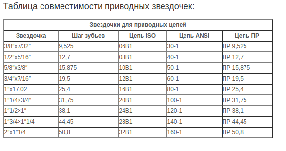
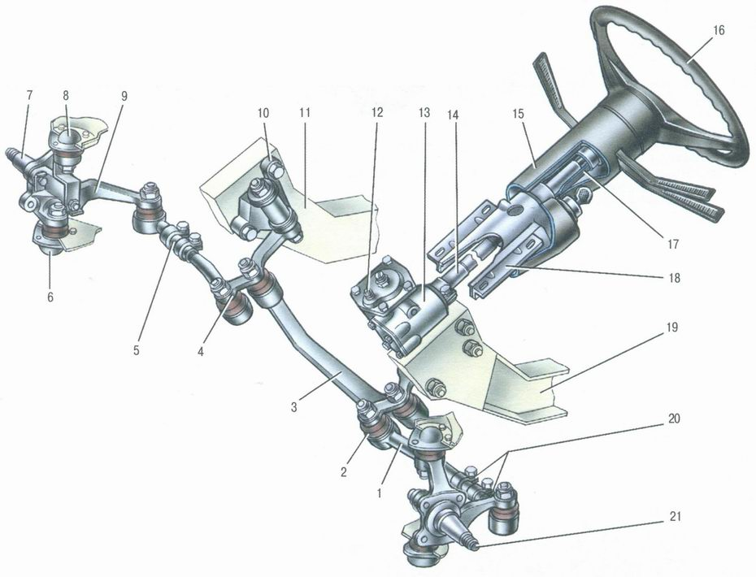
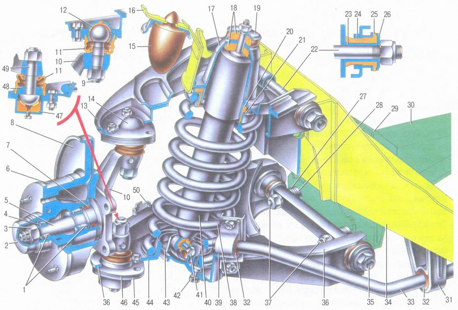

# Бензиновый привод

1. [Двигатель  LIFAN 190F-R D22](https://www.vseinstrumenti.ru/rashodnie-materialy/sadovaya-tehnika/dvigateli/lifan/lifan-dvigatel-benzinovyj-190f-r-15-l-s-190f-r/?gclid=Cj0KCQjwudb3BRC9ARIsAEa-vUsLSs8IDqYrmFQnnES7zEqw_ItfvyozoNizmLdQc3TjysqokWvsGAgaAtYbEALw_wcB)
2. [Втулка тапербуш 1008-22 мм](https://technobearing.ru/eshop1/product/52298611)
3. [Шкив клиновой под втулку тапербуш](https://technobearing.ru/eshop1/product/47736811)
4. \*\*\*\*[Узкий клиновой ремень SPA ](https://technobearing.ru/eshop1/product/remen-sati-spa800)
5. \*\*\*\*[**Клиновые шкивы под зажимную втулку**](http://sati-spb.ru/catalog/klinovie_shkivi_lockdevice)\*\*\*\*
6. [Зажимные комплекты](http://sati-spb.ru/catalog/zazhimnie_komplekti)
7. [Вариатор сафари](http://motodom.su/variator-safari-v-sbore.html) передаточое отношение 1:3
8. [Описание вариатора сафари](http://motosobaky.ru/publikacii/variator-safari-dlya-motobuksirovshhikov-pravila-obsluzhivaniya-i-ekspluatatsii/)

### Информация для рассчёта узлов автомобиля:

* [рассчёт клинового ремня](https://www.youtube.com/watch?v=Lb8ii6uodEk)
* [рассчёт цепной передачи](http://nizrp.narod.ru/raschcepper.pdf)
* [ТЯГОВЫЙ РАСЧЕТ АВТОМОБИЛЯ](http://e.lib.vlsu.ru/bitstream/123456789/7005/1/01699.pdf)
* [виды соединений вал/втулка](http://www.detalmach.ru/lect36.htm)
* [шпонки призматические](http://docs.cntd.ru/document/gost-23360-78)
* [гужон](http://docs.cntd.ru/document/gost-21249-96)

## Параметры для подбора узлов бензо привода:

1. Диаметр приводных колес багги: 0.4 м
2. Максимальная скорость багги 40 км/ч
3. Максимальная скрость вращения вала редуктора двигателя 1800 об/мин.
4. Максимальная скорость вращения вала колёс 530 об/мин
5. понижающая цепная передача передача с коэффицентом редукции 3.4 

##  Подбор цепной передачи:

1. [цепь приводная ПР-12.7-1820-1](https://podolsk-privod.ru/catalog/cepi-privodnye/tsepi-privodnye), длинна 1.5 м
2. [звёздочка на вал редуктора t=12,7 b=5,4 z=10](https://podolsk-privod.ru/catalog/zvezdochki/zvezdochki-dlya-cepey-proizvodstva-ooo-podolsk-privod)
3. \*\*\*\*[Быстро разжемная втулка sati KLAB025](https://podolsk-privod.ru/sites/default/files/bistrozajimnaya_vtulka_0.pdf), посадка вала 25 мм,  диаметр отверстия в звёздочке  50 мм.
4. [Звёздочка на вал колёс под быстро разжемную втулку:](https://podolsk-privod.ru/sites/default/files/zvezdochki_pod_rastochku.pdf) [t=12,7 b=5,4 ](https://podolsk-privod.ru/catalog/zvezdochki/zvezdochki-dlya-cepey-proizvodstva-ooo-podolsk-privod)[ z=34 \(083-1/084-1 12,7 x 4,88 mm\) PS 07034](https://podolsk-privod.ru/sites/default/files/zvezdochki_pod_rastochku.pdf)
5. [Быстрозажимные втулки KLCC025: стоимость  830 р](https://podolsk-privod.ru/)
6. [Проточить один шпоночный паз 200 р. ](https://podolsk-privod.ru/)
7. [габариты вариаторов сафари](http://motodom.su/osnovnye-tekhnicheskie-dannye-zapchastej.html)
8. [посадка lifan-192F](http://motodom.su/dvigatel-lifan-192f.html)

## Габариты и размеры некоторых узлов:

 

 

 

 

### Размеры на усилинную цепь DID 520 HV:

 

## Размеры цепей ПР:

 

## Внешний вид двигателя с редуктором:



###  Замена цепи сьёмником:



### Шлифовка вариатора:



### Развальцовка тормозных трубок:



## **Цены на 2020 г.**

## Список покупок ДВС силовой части:

| Название | Количество | Цена руб. |
| :--- | :--- | :--- |
| [Диск трансмиссии неподвижный](http://motodom.su/disk-transmissii-nepodvizhnyj-vedomyj.html) | 1 | 950 |
| [Диск трансмиссии подвижный](http://motodom.su/disk-transmissii-podvizhnyj.html) | 1 | 950 |
| [Полумуфта ведомая](http://motodom.su/polumufta-vedomogo-shkiva.html) | 1 | 660 |
| [PreviousВидео](https://app.gitbook.com/@simple-buggi/s/project/video) | 1 | 3950 |
| [Реверс редуктор шестеренчатого типа \(+ Z13, под цепь ИЖ\) ](http://shop.motodom.su/revers-reduktory/119-revers-reduktor-shesterenchatyj.html) | 1 | 14800 |
| Пружина ведомого вариатора  | 1 | 120 |
| Двигатель Engine Lifan 190FD \(15л/с, ручной и эл. запуск\) D25, кат.осв. 18А  | 1 | 24730 |
| [ЗВЕЗДОЧКА ВЕДОМАЯ Z 32 шаг 15.875ММ](http://motodom.su/zvezdochka-vedomaya-z-32-izh.html) | 2 | 760 |
| [Тросик газа для мотобуксировщика 2.5 м](http://motodom.su/trosik-gaza-dlya-motobuksirovshchika.html) | 1 | 330 |
| [ЦЕПЬ "ИЖ-ПЛАНЕТА" ПР-15, 875](http://motodom.su/tsep-izhevskaya.html) | 1 | 950 |
| [Звёздочка ведущая z 13 иж с посадкой 25 мм](http://motodom.su/zvezdochka-vedushchaya-z-13-izh.html) | 1 | 760 |
| [Усилинная цепь "ИЖ" \(DIP 520\)](http://motodom.su/usilennaya-tsep-izh-dip-520.html) | 1 | 2700 |
| [Звёздочка цепная однорядная с подшипником 10В-1В13](https://podolsk-privod.ru/catalog/zvezdochki/zvezdochka-natyazhnaya-s-podshipnikom) | 2 | 1320 |
| [Вал-втулочный фиксатор 1803038 Loctite 638 10 ml](https://podolsk-privod.ru/catalog/kley/loctite-638-vysokoprochnyy-universalnyy-val-vtulochnyy-fiksator) | 1 | 970 |

## Список купленых инструментов:

| Название | Количество  | цена руб. |
| :--- | :--- | :--- |
| [Сьёмник цепи](https://aliexpress.ru/item/33027522250.html?spm=a2g0s.9042311.0.0.2eea33edEL5OkL&_ga=2.77933908.1740572431.1594367094-520047512.1591361107) | 1 | 1 326.88 |
| [Набор для развальцовки трубок](https://www.grantauto.ru/catalog/instrument/instrument_spetsialnyy/tormoznaya_sistema/razvaltsovka_tormoznyh_trubok_8_predmetov_JONNESWAY.html) | 1 | 2483.33 |
| [Набор для прокачки тормозов](https://www.grantauto.ru/catalog/instrument/instrument_spetsialnyy/tormoznaya_sistema/prisposoblenie_dlya_prokachki_tormoznoy_sistemy_avtodelo_40077.html?_openstat=bWFya2V0LnlhbmRleC5ydTvQn9GA0LjRgdC_0L7RgdC-0LHQu9C10L3QuNC1INC00LvRjyDQv9GA0L7QutCw0YfQutC4INGC0L7RgNC80L7Qt9C90L7QuSDRgdC40YHRgtC10LzRiyDQkNCy0YLQvtCU0LXQu9C-IDQwMDc3OzQxSnR2RU13RUY5UlFHRzgxWVRCX0E7&ymclid=15947200382434840687200009) | 1 | 269.17 |
| [ключ для прокачки тормоза](https://www.grantauto.ru/catalog/instrument/instrument_spetsialnyy/tormoznaya_sistema/klyuch_prokachki_tormozov_10h12_avtom_.html) | 1 | 138.33 |
| [ Набор рожковых ключей](https://www.220-volt.ru/catalog-623353/?ref=gl_merch_mg&utm_source=google&utm_medium=cpc&utm_campaign=mgcom-gl-src-shopping-ruchnoy_instrument-msk|10517893103&utm_term=&utm_content=k50id|pla-366126851957|cid|10517893103|aid|447599448859|gid|102828678694|pos||src|u_|dvc|c|reg|9047030|rin||&k50id=102828678694|pla-366126851957&gclid=CjwKCAjwmf_4BRABEiwAGhDfSViSLgkvw0gaP1FO2qDTOXsncAMmPf9TH9DjPU5x9KyI0qRDdPqdnhoCoOwQAvD_BwE) | 1 | 700 |
|  |  |  |

## Что может ещё понадобиться:

| Название | Цена руб. |
| :--- | :--- |
| [Подушка двигателя ваз 2121](https://www.avtoall.ru/podushka_vaz_2121_dvigatelya_v_upakovke_avtovaz-647793/) |  |
| [звёздочка z = 40, 15.88 + расточка ](https://podolsk-privod.ru/) | 2405 + 600 |
| [Фонарь светодиодный](https://kolesatyt.ru/catalog/aksessuary/elektrooborudovanie/khodovye-ogni-i-fary/svetodiodnaya-fara-wl-827f-blizhniy-svet/?utm_source=yandexmarket&utm_medium=cpc&utm_campaign=mytishchi.kolesatyt.ru-aks&utm_term=9296324&_openstat=bWFya2V0LnlhbmRleC5ydTvQodCy0LXRgtC-0LTQuNC-0LTQvdCw0Y8g0YTQsNGA0LAgV0wtODI3RiAo0LHQu9C40LbQvdC40Lkg0YHQstC10YIpINCS0YvQvNC_0LXQuyAoNTE4Mik7a2JSQWVOSU5RTlROQ24wSnhXdUpIdzs&ymclid=15959242850176052493600006) | 800 |
| Моторное масло 1л. для четерёх тактных двигателей: SAE 30W. | 600 за 2 л. |
| Масло трансмиссионное 1л. | 200 |

## Чертежи силовой установки:

* [Реверс редуктор](https://cad.onshape.com/documents/b21316542eaf4da69c60d175/w/06073950ddc738940ec0cbc6/e/4e540706f26acaefa303e9b4)
* [Вариатор Сафари на вал 25мм](https://cad.onshape.com/documents/b21316542eaf4da69c60d175/w/06073950ddc738940ec0cbc6/e/5a8fceadc55ac71bed73c51a)
* [Промежуточный редуктор](https://cad.onshape.com/documents/b21316542eaf4da69c60d175/w/06073950ddc738940ec0cbc6/e/dd4903b0372316712a77f2de) 

## технические параметры:

1. Параметры вариатора:
   1. Кпд: 0.8
   2. передаточные отношения:
      1. минимальная \(первая передача\): 2.5
      2. максимальная \(последняя передача\): 0.6
2. Цепной редуктор:
   1. КПД: 0.915
   2. предаточное отношение: 2.46
3. реверс рудуктор:

   1. КПД: 0.97
   2. передаточное отношение: 1

4. КПД схемы: мотор + вариатор + реверс + цепной редуктор + цепной редуктор: **0.64**
5. Максимальная передоваемая мощьность на вал колёс: **6.5 КВат**

## Идеи для реализации передней оси:







### [Рулевое управление ВАЗ 2106](http://car-exotic.com/vaz-cars/vaz-lada-2106-auto-repair-manual-7.html):

### [ Передняя подвеска ВАЗ 2106:](http://car-exotic.com/vaz-cars/vaz-lada-2106-suspension-1.html)

Полезная штука для фрезерного станка, крае-искатель:



## Стеклопластик для создание кожухов цепи и вариатора:

### Что использовать для создания изделия:

* Для мастер модели использовать пенопласт: **пено полиуритан или пхв** он не растворяеться в растворителях
* говорят что можно использовать **пенополистирол \(Пеноплэкс\)** 
* использовать восковый разделитель
* использовать **гелькоут** для первого внешего слоя, наносится на разделитель
* эпоксидку ЭД-20, наиболле рекомендуемая
* полиэфирная смола дешевле и чуть менее токсична, но выдерживает меньшие нагрузки.
* **T-13** конструкционная стеклоткань полотняного переплетения с толщиной ткани 0,27мм и плотностью примерно 285 г/м2.
* **Т-11** конструкционная стеклоткань толщиной 0,28мм с плетением "Сатин 8/3" или "Сатин 5/3". Т-11 обладает большей плотностью \(~385 г/м2\)
* использовать только стеклоткань с силановыми замасливателями **для совместимости с эпоксидной смолой**
* соотношение стеклоткани к смоле 1:2.5 \(вроде как это относится к полефирной смоле\)
* резиновые перчатки, т.к всё прилипнит к рукам
* работать или на открытом воздухе или в помещениии с вентиляцией
* кисточки можно подрезать для более жествого ворса
* шпатели для разглаживания резиновые
* сначала наносится смола потом стеклоткань

{% embed url="https://ru-smola.com/%D0%A1%D1%82%D0%B5%D0%BA%D0%BB%D0%BE%D1%82%D0%BA%D0%B0%D0%BD%D1%8C" %}









