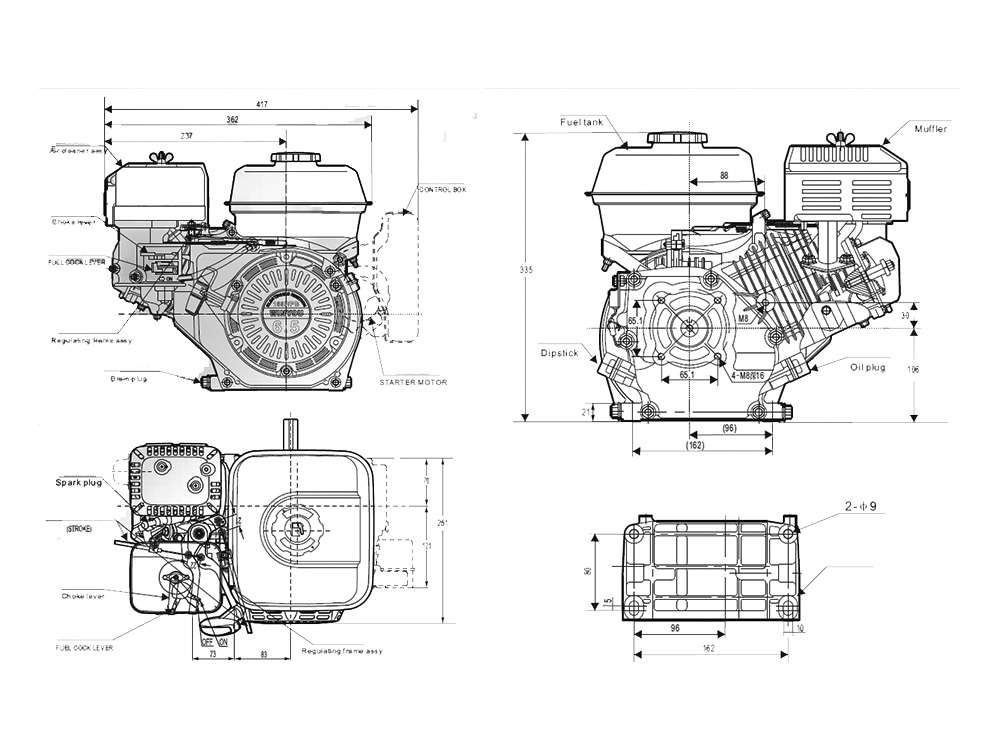

# Мысли об авто снегоуборщике

## Общие:

Если делать переломную схему, сам перелом можно организовать на базе ступицы от ваз и шаровых опор, должно получиться неплохо, при этом приводной вал **придётся пускать ниже или выше** перелома. Тут примеры реализаций:

* [первый](https://www.youtube.com/watch?v=e2OHYJ7wMxU&t=34s)
* [второй](https://youtu.be/o2GFYCxX0dw?t=309)

тут пример как делать [не надо](https://youtu.be/EdDVcY7Cyho?t=88)**,** в переломе только одна степень свободы в вертикальной оси, нужно ещё и в горизонтальной, иначе не всегда все 4-и колеса будут в контакте с дорогой**.**

**Наиболее правильный вариант** это шрус от уаза. Примеры:

* [пример](https://www.youtube.com/watch?v=V7FcsSG3tdU)

Тут ссылка на [магазин](https://spectuninguaz.ru/mosty-uaz/kulak-povorotnyy-uaz/kulak-povorotnyy-pravyy-uaz-452-so-shrusom-spayser-v-sbore-8376) где продаётся шрус.

[Тут](https://www.youtube.com/watch?v=dFKNMt_X_eg) пример **очень достойной велосипедной модели,** по габаритам очень подойдем для небольшого снего-уборщика.

## За и против переломной и велосипедной модели как автоматической платформы:

1. Я всё таки склоняюсь к реализации именно велосипедной модели с полным приводом и качалкой, как **платформы с жёсткой рамой.**
2. В переломной раме, оказывается мало место для размещения оборудования, часть пространства будет просто **пустой** \(место перелома\).
3. В переломной модели, будет технологически сложнее иметь дело с переломом, и по моему это будет самым слабым местом, во время нагрузки на трактор \(когда снег талкает\).
4. в велосипедной модели, узлы все достаточно надёжны на первый взгляд \(кроме рычагов руливой системы\)

## Ревизия 0.1:

Для повышения динамики версии 0.1 возможно стоит рассмотеть вариант с [бензиновым двигателем](https://scooter-zip.ru/category/product/dvigateli-obshego-naznacheniya/168f-2r-20/?utm_source=google&utm_medium=cpc&utm_utm_campaign=scooter-zip.ru_merchant_xml&utm_content=k50id|pla-293946777986|cid|1684223028|aid|326919998551|gid|69212921967|pos|1o2|src|g_|dvc|c|reg|9047030|rin||&utm_campaign=merchant_xml|1684223028&utm_term=&k50id=69212921967|pla-293946777986&gclid=Cj0KCQiA4aXiBRCRARIsAMBZGz-kGIPaPlVXfFyfHMDuAiHpsaVTsw9cJX9-X5sQZmcOWJatf1O8K_QaAlywEALw_wcB):  

Это пример движка с фрикционным сцеплением, вал начинает вращаться при повышении оборотов. Стоимость: **13997 р.**

[Тут](https://goldenmotor.ru/bldc-motors/hpm5000b-fan-cooling/) электромотор на 5kw цена 46300 р., [контрллер](https://goldenmotor.ru/bldc-motors/controller-vec300/) за 37100 р. и [батарей](https://goldenmotor.ru/akkumulyatory/akkumulator-agm-36v-9ah/) на 30 мин работы на полной мощьности 10000 р.

**Получаеться вот такая жопа!!!!: 93400 р. против бензинового за 13997 р.**

